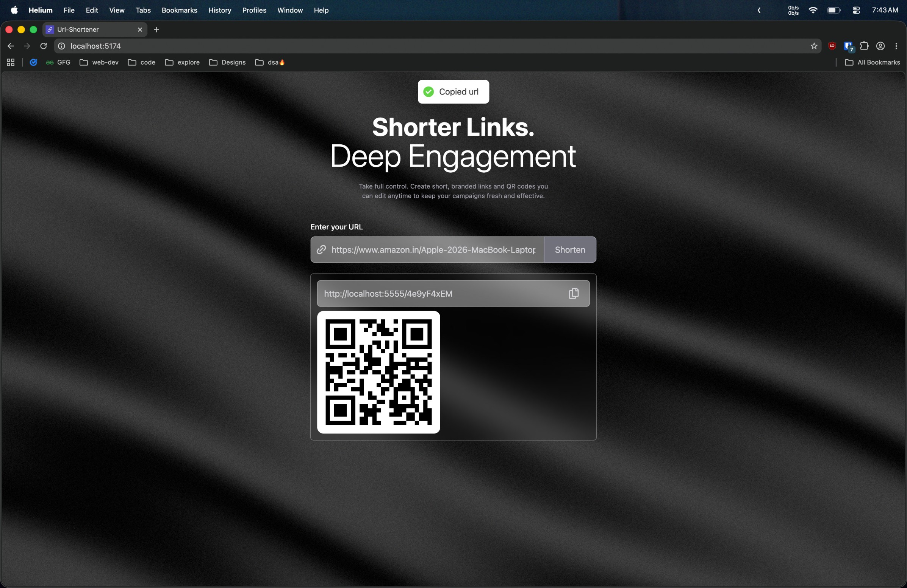

# URL Shortener

An URL shortener with a modern, animated UI. Paste any long URL, get a short link and QR code instantly. Built with React, TypeScript, Express, and MongoDB.



## Features

- **URL Shortening** -- Paste any URL and generate a unique short link
- **QR Code Generation** -- Every shortened URL gets a scannable QR code
- **Copy to Clipboard** -- One-click copy with toast notification feedback
- **URL Redirect** -- Visiting a short URL redirects to the original destination
- **Click Analytics** -- Track total clicks and visit history per short URL
- **Animated Background** -- Custom WebGL silk shader animation via Three.js
- **Responsive Design** -- Works on mobile, tablet, and desktop

## Tech Stack

| Layer | Technology |
|---|---|
| Frontend | React 19, TypeScript, Tailwind CSS v4, Vite 8 |
| Forms | react-hook-form |
| HTTP Client | Axios |
| Animations | Motion (Framer Motion) |
| Notifications | react-hot-toast |
| QR Codes | react-qr-code |
| 3D Graphics | Three.js, React Three Fiber |
| Backend | Node.js, Express 5 |
| Database | MongoDB, Mongoose |
| ID Generation | shortid |


## Installation

### 1. Clone the repository

```bash
git clone https://github.com/ankitsensei/url-shortener.git
cd url-shortener
```

### 2. Install backend dependencies

```bash
cd backend
npm install
```

### 3. Create environment file

Create a `.env` file in the `backend/` directory:

```bash
echo "PORT=5555" > backend/.env
```

### 4. Install frontend dependencies

```bash
cd ../frontend
npm install
```

## Running the Application

Start both servers in separate terminals:

### Backend

```bash
cd backend
npm run dev
```

### Frontend

```bash
cd frontend
npm run dev
```

| Service | URL |
|---|---|
| Frontend | http://localhost:5173 |
| Backend | http://localhost:5555 |

## API Endpoints

### Create Short URL

```
POST /url
```

**Request:**

```json
{
  "url": "https://example.com/very/long/url"
}
```

**Response:**

```json
{
  "id": "abc123"
}
```

### Redirect

```
GET /:shortId
```


## Project Structure

```
url-shortener/
├── backend/
│   ├── index.js              # Express server entry point
│   ├── connect.js            # MongoDB connection
│   ├── controllers/
│   │   └── url.js            # URL creation & analytics handlers
│   ├── models/
│   │   └── url.js            # Mongoose schema
│   └── routes/
│       └── url.js            # Route definitions
└── frontend/
    ├── src/
    │   ├── App.tsx            # Router setup
    │   ├── main.tsx           # Entry point
    │   ├── pages/
    │   │   └── Hero.tsx       # Main UI page
    │   ├── component/
    │   │   └── Silk.tsx       # WebGL shader background
    │   └── index.css          # Tailwind imports
    └── public/
        └── UrlShortener.jpg
```

## Author

Ankit Bhagat

Feel free to fork, improve, and contribute to the project.
